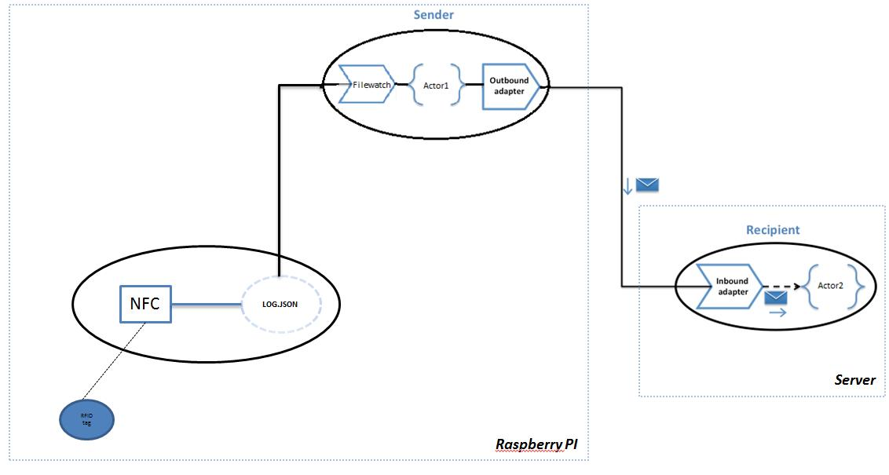

#Architecture of your project

We are going to build an Inboundadapter which watches the file “log.JSON” and sends the ID to an actor each time the file is modified (each the tag is passed above the reader). Then the actor will check if this ID is authorized and if it is all right, the actor will send it to an Outboundadapter which will then send it to the server. On the server side, we will have the same architecture with an Inboundadapter which will get the ID and send it to an actor in order to display the ID of the tag on the screen.

This schema is the representation of what I have explained above. There are two “clusters” as you can see. We also have two actors - one on the raspberry pi and one on the server. The first one (Actor1) checks if the ID is authorized and sends it to the correct actor on the server (Actor2). This actor will just display the ID authorized on the screen. 

Remember to add the proper local database on the Pi (add a Mongodb collection).

[**Previous**](Integrate-nfc-hubiquitus.md)           [**Next**](Configuration.md)
