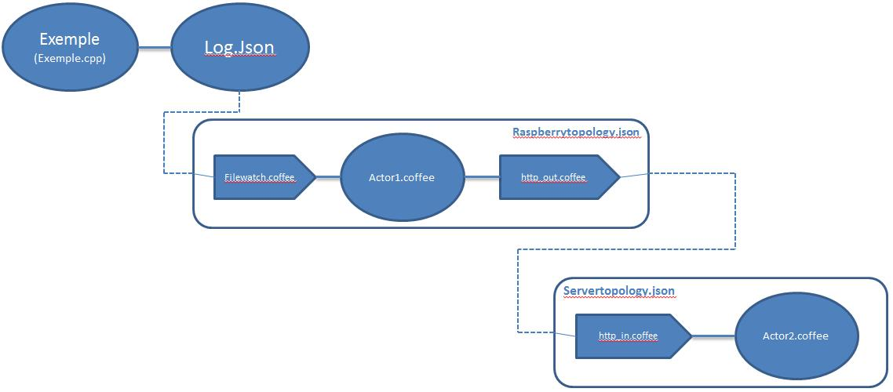

#Configuration and tests

When you look at the architecture you can infer that there are 2 topology files, 2 actors and 3 adapters for the hubiquitus part. There is for the C++ part just one file which executes the NFC reader. Here is the name of each file; you can match it with the previous schema.

You have the detail of each file inside the project. The only things you have to do are adding some authorized Id and configure yours files:

##Configure yours topologies files:

###On the server side:
* Configure the actor which will receive the IDs 
* Configure the  property of the In  http_adapter by adding suitable IP
* Configure the  property of the In http_adapter by adding suitable Port

###On the raspberry pi side:
* Configure the actor which will send the IDs
* Configure the property of the actor by adding Filewatch for inbound_adapter
* Configure the property of the adapter by adding a path to watch
* Configure the property of the actor by adding the recipient
* Configure the property of the actor by adding the Udid recipient
* Configure the  property of the out  http_adapter by adding suitable IP
* Configure the  property of the out http_adapter by adding suitable Port
* Configure the  property of the out http_adapter by adding the recipient 

##Configure the actors:

###On the server side:
Insert a command which will display the ID on the screen (onMessage section)

###On the raspberry pi side:
Configure the suitable collection which contain the authorized IDs
The last thing to do is to modify your Arduino file in order to build your JSON file. Please take a look at the lib directory (exemple.cpp). Be sure to write something on your tag before!

[**Previous**](Architecture.md)           [**Next**](Testandsuggestions.md)
